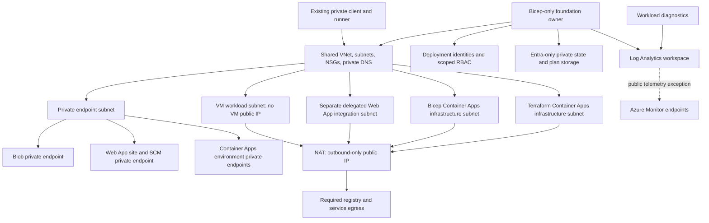

# Architecture

The design separates the application team's request from the platform team's infrastructure implementation. The application repository holds configuration; the catalog owns AVM compositions, environment bindings, and deployment workflows. A PR is the interface between the two, so no portal or cross-repository dispatch credential is needed.

```mermaid
flowchart LR
    Dev[Developer] --> PR[Consumer configuration PR]
    PR --> Public[Hosted runner: validate only]
    Pin[Reviewed catalog SHA] --> Public
    Public --> Review[Maintainer review and merge]
    Review --> Dispatch[Catalog plan dispatch: exact merged consumer SHA]
    Dispatch --> Gate[Revalidate JSON, source, target, and main ancestry]
    Gate --> Planner[Plan on catalog-only private runner: demo-plan]
    Planner --> Saved[Private plans Blob container and sanitized plan_id]
    Saved --> PlanReview[Review private result]
    PlanReview --> Apply[Catalog apply dispatch: same SHA and plan_id]
    Apply --> Pause[Explicit demo-apply environment approval]
    Pause --> Runner[Private runner: verify config, catalog, environment hashes]
    Planner --> OIDC[Entra federated identities]
    Runner --> OIDC
    OIDC --> ARM[Azure control plane]
    Runner --> State[Private Blob backend and protected plan storage]
    ARM --> AVM[Pinned AVM compositions]
    AVM --> Targets[Eight independent workload targets]
```

PR checks run without Azure access. After merge, a maintainer dispatches plan with the consumer's full 40-character SHA, reviews the result, and dispatches apply separately. Apply verifies that the source and environment still match the plan. Both operations require a commit on `main`; merging a PR alone does not start deployment.

## Azure ownership

The Bicep foundation owns shared networking, DNS, NAT, state storage, identities, and resource groups. Each workload consumes those resource IDs. This makes the foundation available before Terraform backend initialization and prevents the two engines from managing the same shared resources.

An existing customer foundation can supply the same [environment bindings](foundation.md). In that mode, the catalog references the resources without importing, redeploying, or deleting them. Any required network or access changes remain with the customer's administrators.

NAT provides outbound connectivity, not traffic inspection or destination filtering. Azure Monitor also uses public endpoints in this design; the production alternatives are covered in the [security review](security-controls.md).

## Private access is service-specific

| Service | Access model |
| --- | --- |
| Storage | Blob Private Link with `privatelink.blob.core.windows.net`. Clients also need an Entra data-plane role. |
| VM | A private NIC and management-source NSG rule. This uses routed SSH, not Private Link; the catalog does not provision a jump host or Bastion. |
| Web App | Inbound Private Link and outbound VNet integration use different subnets. Both the site and SCM names resolve through private DNS. |
| Container App | Private Link terminates at the environment. App-level `external` ingress lets callers outside that environment reach it through the private endpoint, while public network access remains disabled. This differs from an internal-load-balancer-only environment. |

The deployment runner and test client therefore need their own private routes and DNS integration. A standard GitHub-hosted runner does not have that connectivity.

## Execution and data separation

The infrastructure runner reads consumer configuration as JSON. It does not execute consumer scripts, workflows, IaC, install hooks, or application code. Reusable workflows retain the caller's runner context, so the consumer cannot use the catalog's repository-level runner indirectly.

State, plans, environment bindings, and sensitive Azure output stay in private storage. Public job summaries contain only the information needed to identify and review a run.

Application code is built and tested separately, without infrastructure credentials. A reviewed artifact is then deployed over the private network with narrowly scoped release permissions. The [Web App release guide](https://github.com/mocelj/azure-platform-app-demo/blob/main/docs/web-app-payload.md) describes that process.
