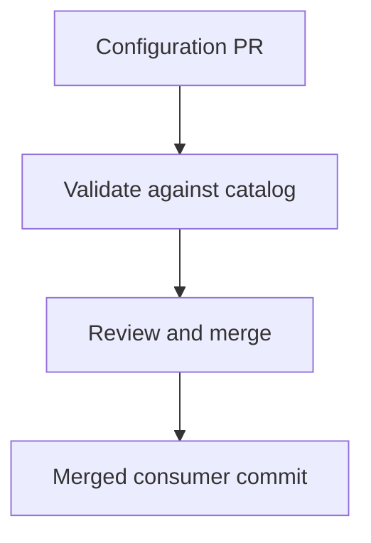
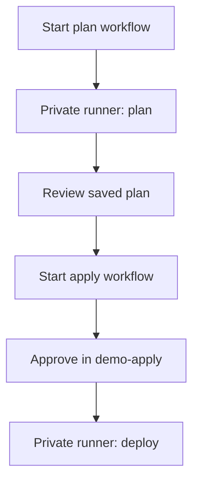
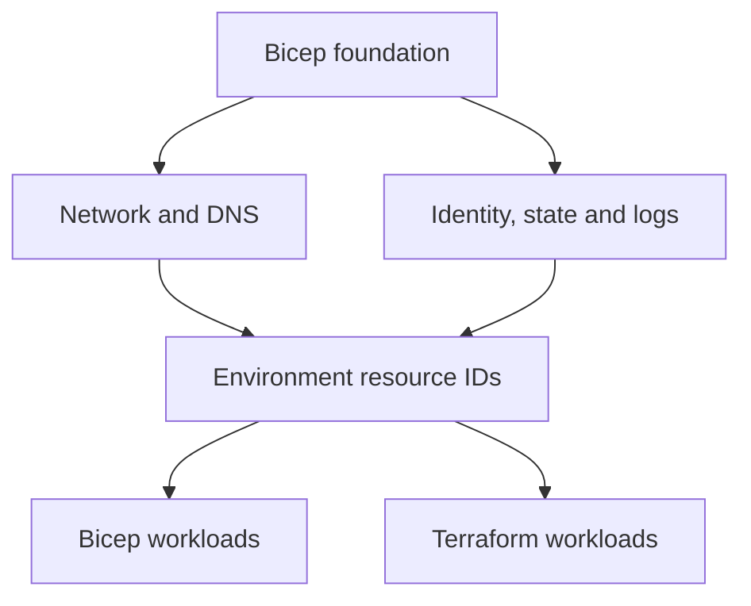

# Architecture

The application repository holds the team's request. The catalog owns the AVM compositions, environment configuration, and deployment workflows. The diagrams below separate three concerns: reviewing a request, deploying it, and managing shared infrastructure.

## 1. Review the application request

The checks run on a GitHub-hosted runner against the consumer's pinned catalog version. They have no Azure credentials or private-state access. Merging the PR records the requested configuration; it does not start an Azure deployment.

## 2. Plan and deploy from the catalog

Both workflows run from the catalog and require the consumer's full 40-character commit SHA to be on `main`. The runner reads the request as JSON and uses the catalog's pinned AVM compositions; it does not execute application code.

Plan stores its result in the private Blob container and returns a `plan_id`. The maintainer reviews that result and starts apply with the same consumer SHA and plan ID. After approval in `demo-apply`, the runner checks that the source, configuration and environment still match before deployment.

The private runner authenticates to Azure through Entra federation using OIDC. Terraform state and saved plans stay in private Blob storage. This workflow is documented but remains disabled in the public demo; CI does not exercise an Azure deployment.

## 3. Shared infrastructure and ownership

Arrows here show configuration dependencies, not network traffic. The foundation owns the shared resources; workload deployments consume their IDs.

| Foundation component | What it provides |
| --- | --- |
| Network and DNS | VNet, subnets, NSGs, private DNS zones and NAT egress |
| Identity | Federated deployment identities and scoped RBAC |
| State and plans | Entra-authorized private Blob storage |
| Monitoring | Shared Log Analytics workspace |
| Resource groups | Separate deployment scopes for all eight workload targets |

Creating the foundation first makes the backend available before Terraform initialization. Bicep and Terraform then manage independent workload instances, without sharing ownership of the foundation or each other's resources.

An existing customer foundation can supply the same [environment bindings](foundation.md). In that mode, the catalog references the resources without importing, redeploying, or deleting them. Any required network or access changes remain with the customer's administrators.

NAT provides outbound connectivity, not traffic inspection or destination filtering. Azure Monitor also uses public endpoints in this design; the production alternatives are covered in the [security review](security-controls.md).

## Private access is service-specific

| Service | Access model |
| --- | --- |
| Storage | Blob Private Link with `privatelink.blob.core.windows.net`. Clients also need an Entra data-plane role. |
| VM | A private NIC and management-source NSG rule. This uses routed SSH, not Private Link; the catalog does not provision a jump host or Bastion. |
| Web App | Inbound Private Link and outbound VNet integration use different subnets. Both the site and SCM names resolve through private DNS. |
| Container App | Private Link terminates at the environment. App-level `external` ingress lets callers outside that environment reach it through the private endpoint, while public network access remains disabled. This differs from an internal-load-balancer-only environment. |

The deployment runner and test client therefore need their own private routes and DNS integration. A standard GitHub-hosted runner does not have that connectivity.

## Execution and data separation

The infrastructure runner reads consumer configuration as JSON. It does not execute consumer scripts, workflows, IaC, install hooks, or application code. Reusable workflows retain the caller's runner context, so the consumer cannot use the catalog's repository-level runner indirectly.

State, plans, environment bindings, and sensitive Azure output stay in private storage. Public job summaries contain only the information needed to identify and review a run.

Application code is built and tested separately, without infrastructure credentials. A reviewed artifact is then deployed over the private network with narrowly scoped release permissions. The [Web App release guide](https://github.com/mocelj/azure-platform-app-demo/blob/main/docs/web-app-payload.md) describes that process.
