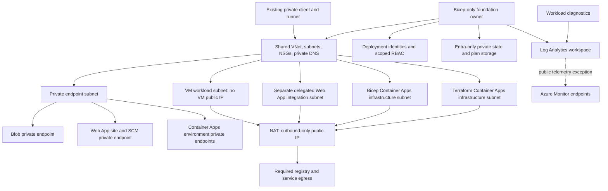

```mermaid
flowchart LR
    Dev[Developer] --> PR[Consumer configuration PR]
    PR --> Public[Hosted runner: validate only]
    Pin[Reviewed catalog SHA] --> Public
    Public --> Review[Maintainer review and merge]
    Review --> Dispatch[Catalog plan dispatch: exact merged consumer SHA]
    Dispatch --> Gate[Revalidate JSON, source, target, and main ancestry]
    Gate --> Planner[Plan on catalog-only private runner: demo-plan]
    Planner --> Saved[Private plans Blob container and sanitized plan_id]
    Saved --> PlanReview[Review private result]
    PlanReview --> Apply[Catalog apply dispatch: same SHA and plan_id]
    Apply --> Pause[Explicit demo-apply environment approval]
    Pause --> Runner[Private runner: verify config, catalog, environment hashes]
    Planner --> OIDC[Entra federated identities]
    Runner --> OIDC
    OIDC --> ARM[Azure control plane]
    Runner --> State[Private Blob backend and protected plan storage]
    ARM --> AVM[Pinned AVM compositions]
    AVM --> Targets[Eight independent workload targets]
```

# Architecture

The platform product is a small, reviewed contract over a composition of AVM modules. There is no portal, dynamic module URL, arbitrary parameter bag, or automatic credentialed cross-repository dispatch.

Both connected operations accept only an exact 40-hex consumer SHA already merged into approved `main`. There is **no premerge Azure preview**: PR checks are offline. Plan and apply have separate dispatches/evidence requirements; apply consumes the reviewed private result and verifies its bindings. The checked-in catalog workflow defines the exact gates. Merging a PR does not automatically deploy anything.

## Azure ownership

This is an ownership/data-flow diagram, not evidence of provisioned resources. NAT is **not** a firewall, packet-inspection service, or destination allowlist.

The foundation creates shared networking, DNS, NAT, private state, identities, and resource groups through Bicep AVM. Terraform begins only after that foundation exists. Terraform workload roots consume bindings; they must not import or manage the Bicep-owned foundation.

In **existing-foundation mode**, the platform supplies validated JSON referencing customer-approved resources. Binding an ID is not adoption. The workloads must not create, mutate, or delete the customer's foundation. See [the foundation contract](foundation.md).

## Private access is service-specific

- **Storage:** Blob private endpoint and `privatelink.blob.core.windows.net`; Entra data-plane authorization remains necessary.
- **VM:** private NIC and approved management route/NSG source, not Private Link. The demo neither creates a public IP for the VM nor provisions a runner/Bastion.
- **Web App:** inbound Private Link and separate outbound VNet integration. Both the site and SCM hostname must resolve privately.
- **Container App:** environment-level Private Link plus app-level ingress. `external` app ingress can permit callers outside the environment **over the private endpoint**; it does not by itself make a private environment public. Internal-load-balancer-only networking is not a substitute for this architecture.

An ordinary hosted GitHub runner has no assumed route to these private endpoints.

## Three things that never cross the trust boundary

1. Consumer scripts, workflows, IaC, install hooks, and payload source do not execute on the infrastructure runner.
2. State, saved plans, real environment bindings, tokens, and sensitive Azure output do not enter public artifacts/logs.
3. A reusable workflow cannot borrow the catalog repository's private runner for a consumer job.

The application release is a separate lane: reviewed payload source → isolated credential-free build/test → reviewed artifact digest → narrowly authorized private deployment. Read the [Web App release guide](https://github.com/mocelj/azure-platform-app-demo/blob/main/docs/web-app-payload.md).
